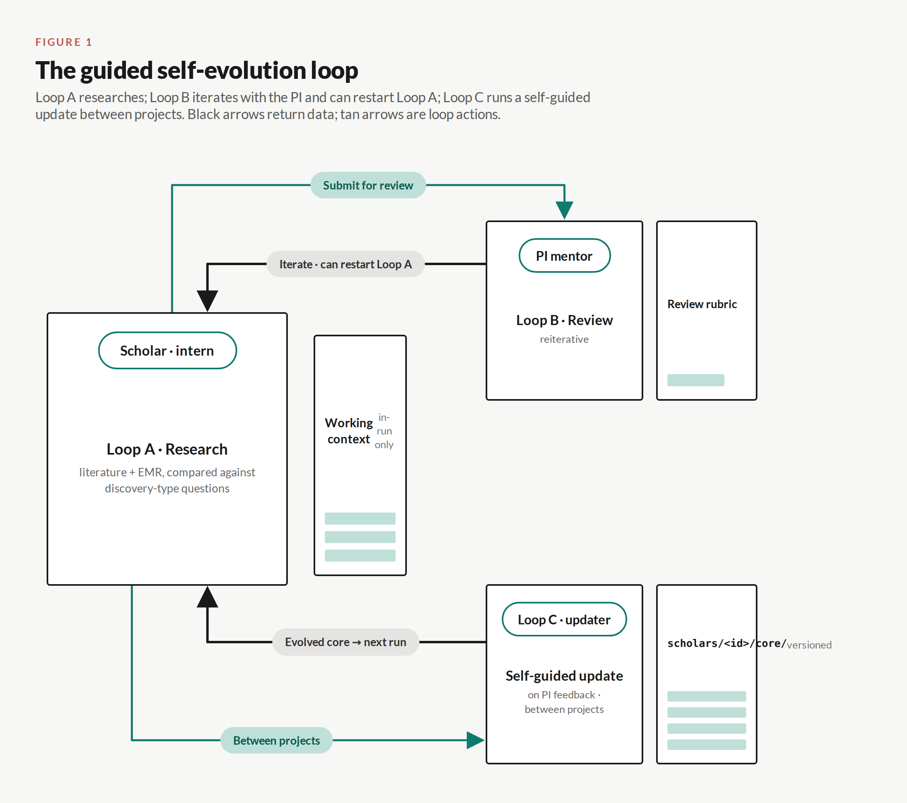
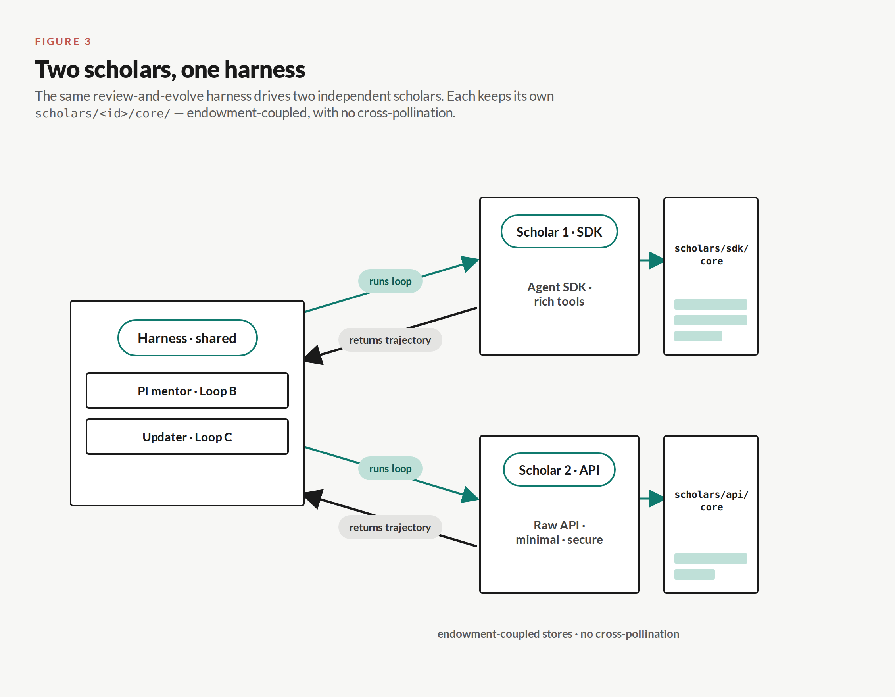
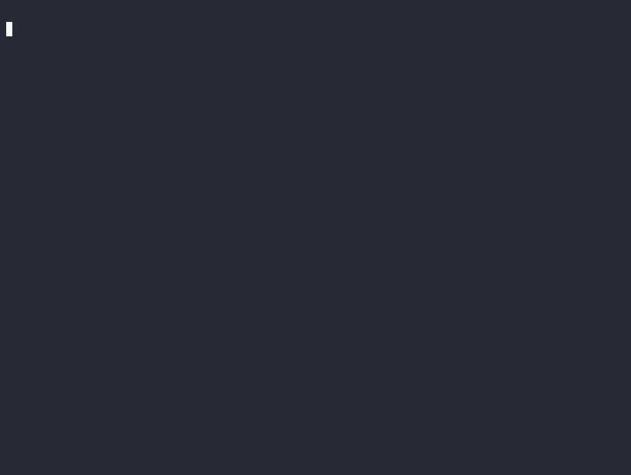

# EvolvingScholar

**Guided self-evolution of an AI Scholar Agent through sequential gene–disease projects.**

> ⚠️ Working title / directory name is provisional and may be renamed. Git history is name-independent, so a rename is safe — see [`docs/project-structure.md`](docs/project-structure.md).

## What this is

An **AI Scholar Agent** (the **Scholar**) that learns the way a real trainee does — mentor-guided, improving across a *sequence* of gene–disease projects — rather than acting as an autonomous co-scientist. Given a gene and a disease it generates research questions, reviews the literature, analyzes (synthetic) EMR data to test associations, and proposes testable hypotheses. At checkpoints it "meets its PI" and receives structured feedback that drives its growth before the next project.

**The question this project actually asks:** *how does research questioning and disease conceptualization evolve* — studied across a human reference panel (college intern → master's → medical student → resident) and an AI Scholar across cycles. The AI is a **controllable model system** for a developmental process that is knowledge-entangled and hard to isolate in humans.

## The core mechanism — three nested loops

- **Loop A — Research activity** (inner): the Scholar does the research for one gene–disease pair.
- **Loop B — Scholar ↔ PI** (middle): structured mentor feedback at checkpoints.
- **Loop C — System update** (outer): rewrites the Scholar's **external, typed, versioned artifacts** between projects.

> **Design invariant — growth is NOT prompt accumulation.** The Scholar does not evolve by growing an ever-longer prompt. Cross-project growth happens only through updates to versioned artifacts under each scholar's [`core/`](scholars/), so "the Scholar evolved" is a legible git diff — not a swelling context window. See [ADR-0001](docs/adr/0001-growth-is-not-prompt-accumulation.md).

### Workflow



*Figure 1 — The guided self-evolution loop.* Loop A researches; Loop B iterates with the PI and can restart Loop A; Loop C runs a self-guided update between projects. Black arrows return data; teal arrows are loop actions.

- **Loop A → B → C is one experiment run.** Loop B may return `needs_more` (new PI tasks) for a partial re-run before it completes.
- **Loop C is the contribution:** it writes the earned EPAs into `core/capabilities/`, which are carried into the next run — the growth curve *is* the git diff.
- **The human-learner analogy:** EPAs accrue along the clinical entrustment ladder (observe → independent → supervise), the same scaffold a trainee climbs.

## What evolves — the evolution stack

From abstract to concrete, these mature in a rough order that traces the student → resident → PhD → PI path:

| Layer | What matures |
|---|---|
| **Goal** | the research aim the work serves |
| **Hypothesis-design logic** | the principles of good question/hypothesis design |
| **Question-asking** | which questions it poses (cognitive × medical-purpose axes) |
| **Concept model** | its working model of the disease |
| **Method repertoire** | good methods found and documented while analyzing |

Knowledge sits *below* this stack, saturated and roughly constant — everything in the stack is the **reasoning/experience** side, made observable.

## Status

**Working pilot — `v0.1.0`.** Both scholars are built and each has completed at least one full **A → B → C** run on the first project, **TTR / hereditary transthyretin amyloidosis (ATTR)** (cohort A):

- **Scholar 1 (SDK)** — Claude Agent SDK, rich tools.
- **Scholar 2 (API)** — raw Messages API, minimal tools; at run 1, entrustment **level 2**, with 4 earned EPAs.

Both scholars are driven by the same review-and-evolve harness, but each keeps its own `scholars/<id>/core/` — endowment-coupled, with no cross-pollination.



*Figure 3 — Two scholars, one harness.* The shared PI-mentor (Loop B) and updater (Loop C) run each scholar's loop and read back its trajectory, while the two scholars' versioned stores stay separate.

Loop A/B/C are implemented; the PI is **human-in-the-loop** (LLM-PI deferred). See [`docs/design-notes.md`](docs/design-notes.md) for the running log, [`docs/adr/`](docs/adr/) for decisions, and [`docs/demo/`](docs/demo/) for run-replay visuals.

### Watch a run

Deterministic replay of a captured **A → B → C** run — it reads only on-disk capture (no live agent, no API calls, no tokens), so it regenerates from the committed `.cast` source.

**Scholar 2 (API):**


**Scholar 1 (SDK):**



## Repo map

```
scholars/<id>/  the two evolving scholars (sdk, api): engine.py + core/ (versioned — git history = the evolution record) + runs/
common/         shared SDK-free primitives: capture, EMR tools, prompts, projects, persona
harness/        shared experiment machinery: PI mentor, Loop C updater, evaluator
schemas/        record schemas: capture layers, question registry, review rubrics
experiments/    cross-scholar analysis outputs (results/): trajectories, transfer matrix, plots
data/           synthetic EMR + curated literature for the pilot
docs/           the build record: design log, ADRs, this structure doc, references
```

Full annotated structure: [`docs/project-structure.md`](docs/project-structure.md).
